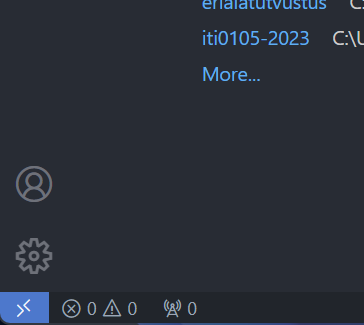

# Converter

Convert anything form anywhere

## Development

To develop on this project you have 2 options:

1) use VSCode **dev container** (preffered)
2) use your **own** environment

### VSCode dev container
Using a dev container you dont need to setup anything on your own. All the **helpful extentions** are installed for you, all the **dependencies** are installed for you, and you can **start developing right away**.

Before you start developing in a dev container you will need to install 2 things on your system:

1) [Docker](https://docs.docker.com/get-docker/)
2) [VSCode](https://code.visualstudio.com/download)

NB! After you have installed Docker you **dont need to do anything with it**. VSCode will use it for you.

After you have installed Docker and VSCode you can start developing in a dev container:

1) Clone this repo:
In your terminal run:
```
git clone https://gitlab.cs.taltech.ee/ririvi/iti0105-2023.git
```
2) Open the project in VSCode:
```
cd iti0105-2023
code .
```

3) Click the blue button in the bottom left corner of VSCode (open in remote window):




4) After clicking it you will see a popup. Click "Reopen in Container"

5) Wait for the container to build and you are ready to go! (it can take several minuter when you open the project for the first time).


### Your own environment
If you dont want to use a dev container you can setup your own environment. If you choose this route you will need to install all the dependencies yourself and you will need to install all the helpful extentions yourself.